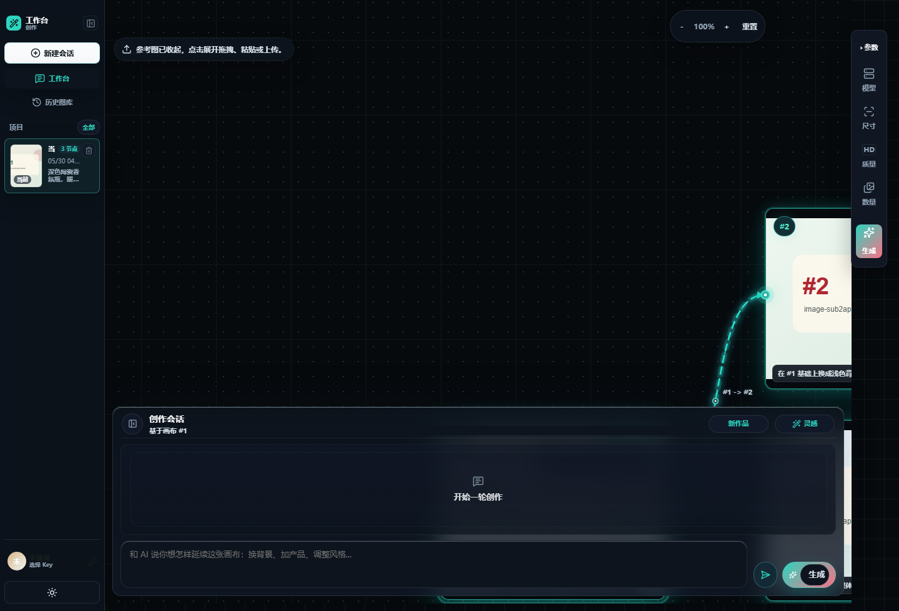
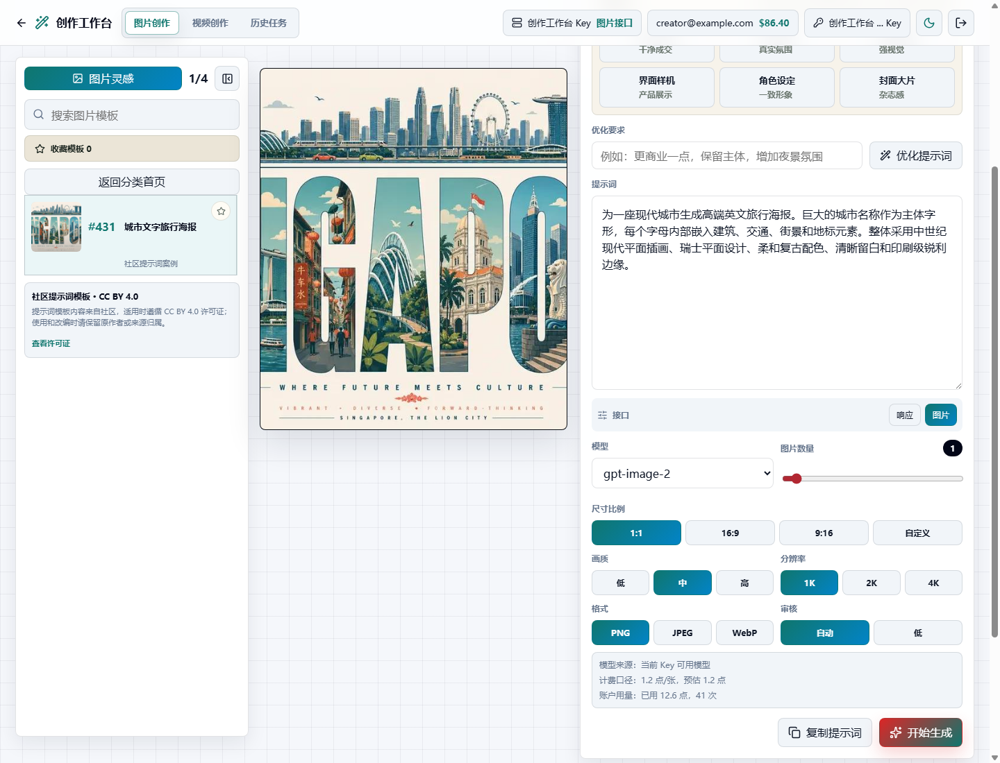
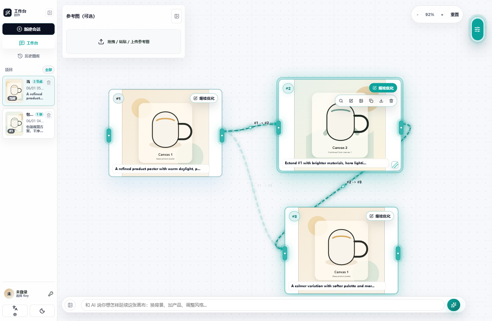
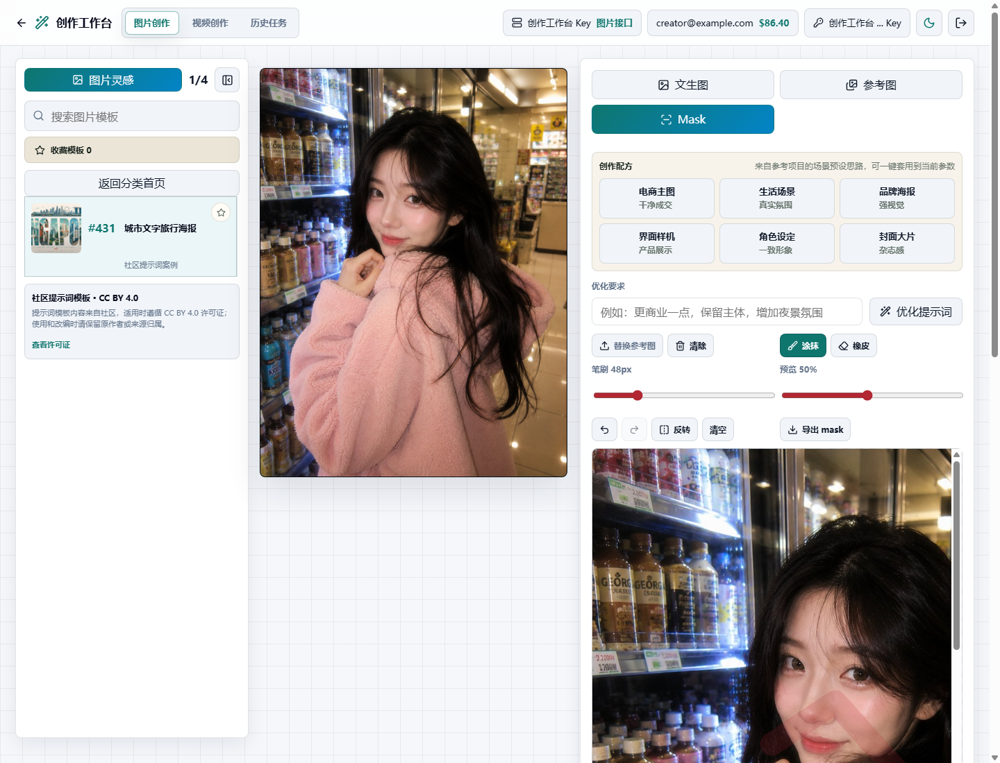
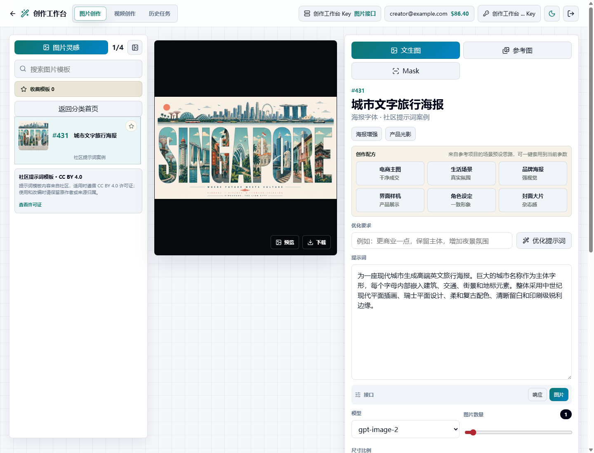
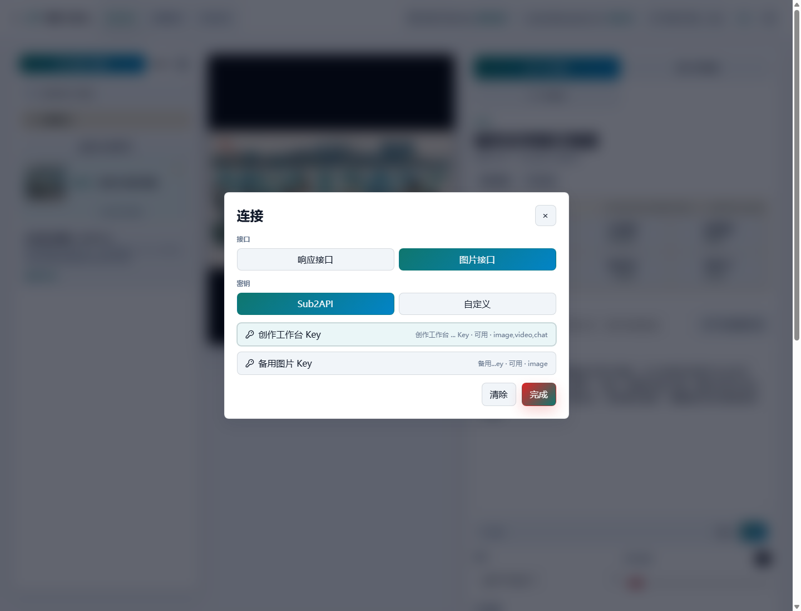
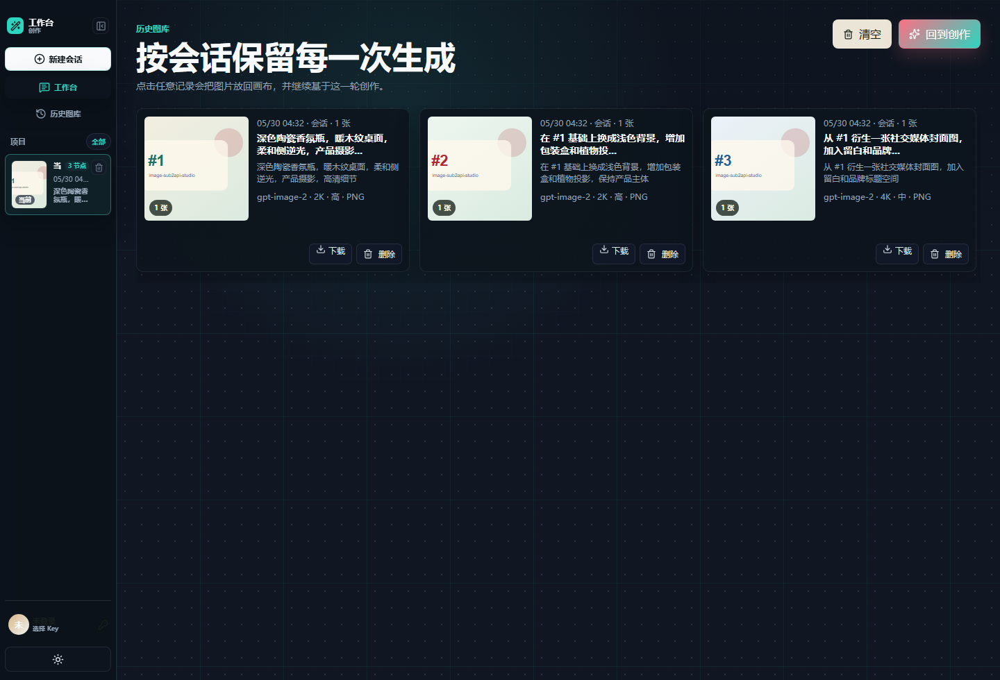
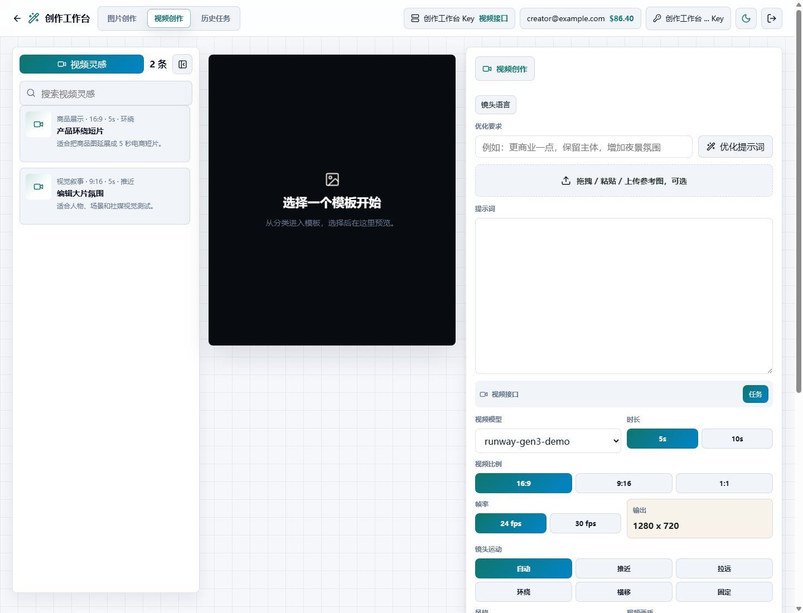

# image-sub2api-studio

`image-sub2api-studio` 是一个基于 Sub2API 的开源生图工作站。

Sub2API 已经负责模型接入、用户 Key、额度、计费和 OpenAI 兼容接口。本项目补上前台创作层：用户可以在一个页面里写提示词、选择自己的 Sub2API Key、选择模型、上传参考图、调整生成参数、预览结果、下载产物，并管理历史记录。

演示入口：[studio.ohlaoo.com/studio/](https://studio.ohlaoo.com/studio/)

<p align="center">
  <a href="https://github.com/margetrp-hub/image-sub2api-studio"></a>
  <a href="./LICENSE"></a>
  <a href="./README.md"></a>
</p>

## 项目定位

这个项目不是模型服务，也不是单纯的提示词集合。它是一个可以自托管的 Sub2API 生图创作工作台。

- Sub2API 负责账号登录、API Key、模型、额度、计费和网关接口。
- `image-sub2api-studio` 负责用户可见的生图工作流。
- 提示词模板和灵感样例只是启动内容；生产环境可以通过 `/studio-api/library` 返回私有模板库。

## 界面截图

截图使用演示数据，Key 已打码。

















## 核心能力

- 通过 Sub2API 兼容接口完成文生图。
- 支持选择文件、拖拽、粘贴上传参考图。
- 支持 Mask 局部重绘工作流。
- 支持模型、数量、比例、画质、输出格式、审核级别、1K/2K/4K 分辨率意图控制。
- 支持从 Sub2API 用户 Key 列表中选择 Key，并在界面中打码展示。
- 支持本地历史记录，也支持按 Sub2API 用户隔离的服务端历史记录。
- 图片创作和视频创作分区管理。
- 提供 Nginx 示例，用于在素材库后端化后阻断静态提示词和图片路径。

## 技术结构

```text
.
├── src/
│   ├── studio.jsx                         # 创作工作台主界面
│   ├── studio.css                         # 工作台样式
│   ├── sub2apiClient.js                   # Sub2API / OpenAI 兼容接口客户端
│   └── studio/                            # 纯函数工具与本地存储工具
├── scripts/
│   ├── image-sub2api-studio-history-service.mjs
│   ├── check-sub2api-contract.mjs
│   └── package-studio-core-update.mjs
├── deploy/
│   ├── nginx-sub2api-studio.conf
│   ├── docker-nginx.conf
│   ├── image-sub2api-studio-history.service
│   └── UPDATE-SERVER.zh-CN.md
├── docs/
│   ├── DEPLOY.zh-CN.md
│   ├── DOCKER.zh-CN.md
│   ├── open-source-config.zh-CN.md
│   ├── sub2api-studio-overlay.md
│   ├── templates.md
│   └── screenshots/
├── public/
│   ├── cases.json                         # 轻量启动模板
│   ├── inspirations.json                  # 空的扩展入口
│   ├── inspiration-sources.json
│   └── style-library.json
└── studio.html
```

## 快速开始

```bash
npm install
cp .env.example .env.local
npm run dev:studio
```

构建生产包：

```bash
npm run build
```

部署到 `/studio/` 子路径：

```bash
STUDIO_BASE_PATH=/studio/ npm run build
```

Windows PowerShell：

```powershell
$env:STUDIO_BASE_PATH="/studio/"
npm run build
Remove-Item Env:\STUDIO_BASE_PATH
```

## 环境变量

最小配置：

```env
VITE_SUB2API_BASE_URL=https://sub2api.example.com
VITE_SUB2API_GATEWAY_BASE_URL=https://sub2api.example.com
VITE_SUB2API_IMAGE_ROUTE=responses
VITE_SUB2API_RESPONSES_MODEL=gpt-5.5
VITE_SUB2API_LOGIN_URL=https://studio.example.com/login
VITE_STUDIO_HISTORY_BASE_URL=https://studio.example.com
VITE_STUDIO_BACK_URL=/
VITE_STUDIO_LIBRARY_AUTH_REQUIRED=false
```

说明：

- `VITE_SUB2API_BASE_URL` 会自动补成 `/api/v1`，用于登录、用户信息和 Key 列表。
- `VITE_SUB2API_GATEWAY_BASE_URL` 会自动补成 `/v1`，用于生成接口。
- `VITE_SUB2API_IMAGE_ROUTE=responses` 使用 `/v1/responses` + image generation 工具。
- `legacy` 使用 `/v1/images/generations`。
- `VITE_STUDIO_HISTORY_BASE_URL` 指向可选历史记录服务所在域名。
- `VITE_STUDIO_LIBRARY_AUTH_REQUIRED=false` 表示开源启动模板无需登录即可显示。只有在 `/studio-api/library` 已部署、并且静态模板路径已阻断时，才改为 `true`。

## 部署

静态文件可以部署到 Nginx、Docker、Vercel、对象存储或普通 VPS。

常见生产路径：

```text
/var/www/image-sub2api-studio/    # 静态文件
/opt/image-sub2api-studio/        # 可选 Node 历史服务
/var/lib/image-sub2api-studio/    # 用户历史和受保护素材库
```

更多部署细节：

- [部署指南](docs/DEPLOY.zh-CN.md)
- [Docker 快速部署](docs/DOCKER.zh-CN.md)
- [服务器更新说明](deploy/UPDATE-SERVER.zh-CN.md)

## 素材库策略

GitHub 首版不包含大图片库，只提供轻量 JSON，方便项目开箱启动。

生产环境建议：

- 大图放在服务器、对象存储或私有 CDN。
- 私有提示词和素材通过 `/studio-api/library` 在登录后返回。
- 如果不希望素材被爬虫直接抓取，可以阻断 `/studio/images/`、`cases.json`、`inspirations.json` 的静态访问。
- 服务器已经上传过图片库时，后续只更新 JS/CSS/HTML 不需要重新上传图片。

## Sub2API 合约检查

```bash
SUB2API_BASE_URL=https://sub2api.example.com \
SUB2API_EMAIL=you@example.com \
SUB2API_PASSWORD='your-password' \
npm run check:sub2api
```

这个检查只验证登录、用户资料和 Key 列表，不会发起付费生成。

## 提示词来源与致谢

社区提示词项目和公开案例只作为提示词来源、案例学习素材和学习参考，不构成本项目来源或归属。

提示词模板内容来自社区，适用时遵循 `CC BY 4.0` 许可证；使用和改编时请保留原作者或来源归属。

项目来源、参考来源和素材边界见：[致谢与参考边界](docs/ACKNOWLEDGEMENTS.zh-CN.md)。

## 作者与授权

维护者：[@margetrp-hub](https://github.com/margetrp-hub)

代码按 [MIT License](LICENSE) 开源。
